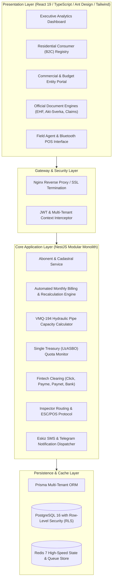

<div align="center">

# 💧 SuvControl — Enterprise Water Utility ERP & Smart Billing Platform
### National-Scale Multi-Tenant Digital Infrastructure for Municipal & Regional Water Authorities

[](https://www.typescriptlang.org/)
[](https://nestjs.com/)
[](https://react.dev/)
[](https://www.postgresql.org/)
[](https://www.prisma.io/)
[](https://www.docker.com/)

**National Hackathon Architectural Showcase Edition**

</div>

---

## 📌 Executive Summary & Problem Statement

**SuvControl** is an enterprise-scale digital billing, resource governance, and automated revenue-assurance platform engineered specifically for municipal and regional water utility authorities (*O'zsuvta'minot* ecosystem in Uzbekistan).

Modern municipal water networks in developing regions face three acute operational bottlenecks:
1. **Non-Revenue Water (NRW) & Pipeline Tampering**: Significant revenue loss caused by unauthorized connection bypasses, broken meter seals, and unmetered consumption.
2. **Commercial & Budget Organization Overspending**: State institutions (schools, kindergartens, public hospitals) frequently exceed approved treasury water consumption limits without automated, proactive early alerts.
3. **Invoicing & Audit Latency**: Traditional accounting depends on manual field books, slow bilateral balance reconciliation statements (*Akt-Sverka*), and fragmented value-added tax (12% VAT) invoice compilation.

**SuvControl** delivers a unified, production-tested platform that eliminates these inefficiencies through automated hydraulic pipe-diameter sanction engines, live electronic invoicing integration, multi-tier B2B hierarchies, mobile Bluetooth POS printing, and immutable audit logs.

---

## 🏛️ System Architecture



---

## ⚡ The 7 Pillars of SuvControl

### 1. 🏡 Residential (B2C) Billing & Cadastral GIS
* **Territorial Hierarchy**: Multi-level partitioning: District (*Tuman*) $\rightarrow$ Neighborhood Community (*Mahalla*) $\rightarrow$ Street $\rightarrow$ Household.
* **Progressive Social Tariffs**: Tiered consumption billing incentivizing water conservation.
* **Complete Consumer Ledger**: Granular inspection history, photo-verification evidence, delta consumption tracking, and payment balances.
* **Retroactive Recalculation Engine**: Algorithmic recalculation across historical billing cycles upon verified tariff or meter adjustment.

### 2. 🏢 Commercial, Industrial & Budget Governance (B2B)
* **4-Tier Structural Modeling**: 
  $$\text{Parent Corporation (STIR / INN)} \longrightarrow \text{Physical Facilities} \longrightarrow \text{Connection Points (Pipes)} \longrightarrow \text{Meters}$$
* **Gosstandart VMQ-194 Hydraulic Sanction Calculator**: Automatically calculates unmetered consumption based on cross-sectional pipe diameter and regulatory pressure:
  $$Q = \pi \cdot \left(\frac{d}{2}\right)^2 \cdot v \cdot t$$
* **Single Treasury Account (UzASBO) Monitoring**: 27-digit treasury account tracking with automated alert thresholds at **80%** (Risk) and **100%** (Exceeded/Quota Deficit).
* **Didox & Soliq.uz EHF Automation**: 12% Value Added Tax (VAT) computation, MXIK/IKPU product classification (`03600001001000000`), and bulk Excel export for instant tax portal clearance.
* **Official Regulatory Documents**: Automated PDF and sheet generation for Bilateral Reconciliation (*Akt-Sverka*), Calculation Certificates (*Spravka-Raschyot*), and Pre-Trial Claims (*Pretenziya*).

### 3. 📱 Field Operations & Mobile Bluetooth POS Printing
* **Inspector Fleet Management**: Real-time assignment of territorial zones, collection quotas, and route tracking.
* **ESC/POS Bluetooth Thermal Printing**: Instant generation of 58mm/80mm physical receipts in the field containing verification QR codes and fiscal details.
* **Daily Settlement Workflow**: End-of-day reconciliation verifying field cash collections before ledger close.

### 4. 💳 Omnichannel FinTech Payment Clearing
* **Click Merchant & Click Pass**: Real-time consumer balance discovery and instant webhook clearance.
* **Payme Checkout**: Seamless QR code and account-driven mobile payments.
* **Paynet Integration**: Offline agent network transaction synchronization.
* **Automated Commercial Bank Matching**: Automated parsing of bank statement registries (*Platyojka*) and balance assignment.

### 5. ⚖️ Debt Recovery CRM & Automated Notifications
* **Eskiz.uz SMS Gateway**: Automated dispatch of debt alerts, payment receipts, and billing period closures.
* **Statutory Utility Penalty (*Penya*) Engine**: Daily accrual at $0.1\%$ per day of overdue principal, strictly capped at $50\%$ in accordance with national commercial utility statutes:
  $$\text{Penalty} = \min\left(\text{PrincipalDebt} \times 0.001 \times \text{DaysOverdue}, \; 0.50 \times \text{PrincipalDebt}\right)$$
* **Enforcement Pipeline**: Automated escalation stages: SMS Reminder $\rightarrow$ Network Disconnection Warning $\rightarrow$ Enforcement Bureau (MIB) & Judicial Litigation.

### 6. ⏱️ Meter Verification & Metrological Lifecycle (Gosstandart)
* **Periodic Metrological Verification (*Davlat Qiyoslovi*)**: Automated tracking of verification expiration dates.
* **30-Day Proactive Advance Notice**: Early alerting system transitioning uncertified meters to standard capacity tariffs.
* **Meter Replacement Protocol**: End-to-end documentation of old reading finalization, seal replacement, and serial certification.

### 7. 📊 Executive Analytics & Tamper-Proof Audit Trail
* **Executive KPI Dashboards**: Real-time analytics on gross billed volume, collection ratios, regional debitor/creditor balances, and non-revenue water.
* **Tamper-Proof Audit Trail**: Backed by PostgreSQL stored triggers enforcing **strict immutability** on all financial transactions and operational logs.
* **Row-Level Security (RLS)**: Enforces complete physical and logical isolation between administrative districts on a unified database instance.

---

## 📂 Repository Layout & Component Architecture

```
suvcontrol-core/
├── README.md                          # Master Hackathon Documentation
├── .env.example                       # Sanitized Environment Configuration
├── backend/
│   ├── prisma/schema.prisma          # Complete Multi-Tenant Database Schema (27 Tables)
│   └── src/
│       ├── abonent/                  # Consumer Management (B2C & B2B)
│       ├── address/                  # Cadastral & Territorial Registry
│       ├── audit/                    # Immutable Transaction Audit System
│       ├── auth/                     # Multi-Tenant JWT & RBAC Guard
│       ├── billing/                  # Automated Billing Run & Recalculation Engine
│       ├── collection/               # Debt Enforcement & Legal Pipeline
│       ├── collector/                # Field Agent & Mobile POS Management
│       ├── meter/                    # Smart Metering & Metrology Verification
│       ├── payment/                  # Click, Payme, Paynet & Bank Clearing Controllers
│       ├── sms/                      # Eskiz.uz SMS Notification Integration
│       ├── tariff/                   # Progressive Multi-Tier Tariff Matrix
│       └── tenant/                   # Enterprise Legal Entity & District Profile
├── frontend/
│   ├── src/
│   │   ├── pages/                    # 13 Complete Production UI Management Consoles
│   │   │   ├── Dashboard.tsx         # Central Executive Analytics Console
│   │   │   ├── AbonentCard.tsx       # B2C Residential Consumer Directory
│   │   │   ├── AbonentDetails.tsx    # 360-Degree Consumer Ledger & Audit History
│   │   │   ├── LegalEntities.tsx     # B2B Enterprise & Treasury Quota Portal
│   │   │   ├── Payments.tsx          # Universal Payment Processing & Bank Clearing
│   │   │   ├── Collectors.tsx        # Inspector Fleet & Thermal Printer Configuration
│   │   │   ├── Collections.tsx       # Debt Recovery & Enforcement CRM
│   │   │   ├── Billing.tsx           # Monthly Billing Closure & Ledger Balancing
│   │   │   ├── Addresses.tsx         # Cadastral Directory (Mahalla & Street)
│   │   │   ├── SmsQueue.tsx          # Automated SMS Dispatch Queue
│   │   │   ├── Reports.tsx           # Operational Utility Reports
│   │   │   ├── TaxReports.tsx        # State Tax Authority (DSQ) Invoicing Reports
│   │   │   └── GovernmentReports.tsx # National Water Resource Balance Statements
│   │   ├── components/documents/     # Regulatory Document Generators (EHF, Akt-Sverka, Sanctions)
│   │   └── utils/                    # Didox Excel Batch Export & Number-to-Words Engine
└── docs/
    ├── ARCHITECTURE.md               # Technical Deep-Dive & Data Isolation Model
    └── B2B_SPEC.md                   # Regulatory Compliance & Invoicing Standards
```

---

## 🔒 Hackathon Evaluation & Security Notice

> [!NOTE]
> **Showcase & Architectural Preview**:
> This repository represents the **architectural blueprint, interface contracts, regulatory math engines, and UI design systems** submitted for hackathon evaluation.
>
> To safeguard active utility consumers, commercial IP, and production security:
> * Active production database credentials, private encryption keys, and SMS gateway tokens have been sanitized or stubbed.
> * Live automated billing background worker loops and payment provider webhook secrets are isolated in the private production cluster.
> * A fully operational live deployment is active at **[https://suvcontrol.uz](https://suvcontrol.uz)**.

---

## 👥 Authors & Project Leadership

* **Sharipov Bahodir** — Project Author & Chief System Architect
* Project: **SuvControl (Water Utility Governance)**
* Repository: [github.com/AbdullohMunzir/suvcontrol-core](https://github.com/AbdullohMunzir/suvcontrol-core)
* Live Production Environment: [suvcontrol.uz](https://suvcontrol.uz)
