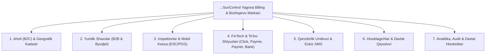

<div align="center">

# 💧 SuvControl — Enterprise Water Utility ERP & Billing Platform
### National Scale Multi-Tenant Digital Infrastructure for Municipal & Regional Water Authorities

[](https://www.typescriptlang.org/)
[](https://nestjs.com/)
[](https://react.dev/)
[](https://www.postgresql.org/)
[](https://www.prisma.io/)
[](https://www.docker.com/)

**National Hackathon Architectural Showcase Edition**

</div>

---

## 📌 Loyiha Haqida / Executive Summary

**SuvControl** — bu O‘zbekiston Respublikasi suv ta’minoti korxonalari (*O‘zsuvta’minot* tizimi, viloyat va tuman suv ta’minoti korxonalari) uchun maxsus ishlab chiqilgan, barcha turdagi iste’molchilarni (Aholi va Yuridik shaxslar), nazoratchilar tarmog‘ini, to‘lov tizimlarini va moliyaviy hisobotlarni yagona avtomatlashtirilgan markazga birlashtiruvchi **yaxlit korporativ ERP & Billing platformasi**.

Tizim shunchaki hisoblagich ko‘rsatkichini yozib borish vositasi emas, balki suv resurslarini boshqarish, noqonuniy ulanishlarga chek qo‘yish, debitorlik qarzdorligini qisqartirish va to‘lovlarni 100% raqamlashtirishning to‘liq siklini ta’minlaydi.

---

## 🏛️ Tizimning 7 Ta Asosiy Ustuni / The 7 Pillars of SuvControl



---

### 1. 🏡 Aholi (B2C) va Geografik Kadastr
* **Mahalla va Ko'cha Ierarxiyasi**: Tuman $\rightarrow$ Mahalla fuqarolar yig'ini $\rightarrow$ Ko'cha $\rightarrow$ Xonadon tuzilishi.
* **Ko'p Pog'onali Ijtimoiy Tariflar**: Iste'mol hajmiga qarab progressiv tariflar hisob-kitobi.
* **Abonentning To'liq Tarixi**: Har bir abonent bo'yicha ko'rsatkichlar dinamikasi, fotosuratlar, hisoblangan schyotlar va to'lovlar balansi.
* **Retroaktiv Qayta Hisob-kitob**: Tarif o'zgarganda yoki xatolik tuzatilganda o'tgan davrlar uchun avtomatlashtirilgan qayta hisoblash (recalculation engine).

### 2. 🏢 Yuridik Shaxslar (B2B, Sanoat va Byudjet Tashkilotlari)
* **4 Bo'g'inli Korxona Modeli**: Bosh korxona (STIR/INN) $\rightarrow$ Obyektlar/Filiallar $\rightarrow$ Ulanish nuqtalari (quvurlar) $\rightarrow$ Hisoblagichlar.
* **O'zbekiston VMQ-194 Quvur Sanksiyasi Formulasi**: Tamg'a buzilganda quvur diametri va bosimi bo'yicha hisoblash:
  $$Q = \pi \cdot \left(\frac{d}{2}\right)^2 \cdot v \cdot t$$
* **G'aznachilik / UzASBO Nazorati**: 27 xonali g'azna hisoblari bo'yicha yillik va oylik limitlar monitoringi (80% xavf va 100% oshib ketish ogohlantirishlari).
* **Didox va Soliq.uz EHF**: 12% QQS va MXIK kodi (`03600001001000000`) bilan oylik hisobvaraq-fakturalarni ommaviy Excel formatida generatsiya qilish.
* **Rasmiy Hujjatlar Generatorlari**: Akt-sverka, Spravka-raschyot, Sanksiya dalolatnomasi, Sudgacha bo'lgan Pretenziya.

### 3. 📱 Inspektorlar va Mobil Kassa (Field Agents & ESC/POS)
* **Nazoratchilar Parki**: Tuman bo'yicha inspektorlar marshruti, biriktirilgan hududlar va kunlik reja.
* **Portativ Termoprinter Cheki**: Joyning o'zida Bluetooth orqali 58mm/80mm termoprinterda QR-kodli to'lov va ko'rsatkich kvitansiyasini chop etish.
* **Kunlik Inkassatsiya (Daily Settlement)**: Inspektor tomonidan yig'ilgan naqd pullarni kun yakunida kassaga topshirish va qabul qilish akti.

### 4. 💳 FinTech & To'lov Tizimlari Kliringi
* **Click Merchant & Click Pass**: Real vaqt rejimida abonent qarzini ko'rsatish va to'lovni avtomat qabul qilish.
* **Payme Checkout**: QR-kod va abonent hisob raqami orqali onlayn to'lov integratsiyasi.
* **Paynet Tranzaksiyalari**: Terminal va shoxobchalar orqali qabul qilingan to'lovlarni qayta ishlash.
* **Bank Kliringi**: Bank to'lov topshirig'i (Platyojka) reestrini yuklab, tegishli korxona va abonentlarga biriktirish.

### 5. ⚖️ Qarzdorlik Undiruvi & SMS E-Ogohlantirish
* **Eskiz.uz SMS Gateway**: Qarzdorlarga avtomatlashtirilgan ogohlantirish xabarlari va to'lov tasdiqlari.
* **Qonuniy Penya Dvigateli**: Kunlik 0.1% penya hisoblash (asosiy qarzning 50% gacha cheklangan).
* **Undiruv Quvuri (Collections CRM)**: Ogohlantirish $\rightarrow$ Tarmoqdan uzish $\rightarrow$ Majburiy ijro byurosi (MIB) va Sudga da'vo arizalari tayyorlash.

### 6. ⏱️ Hisoblagichlar & Davlat Qiyoslovi (Gosstandart)
* **Davlat Qiyoslovi Monitoringi**: Qiyoslov muddati tugashiga 30 kun qolganda tizimda avtomatik xabar berish.
* **Hisoblagich Almashtirish Dalolatnomasi**: Eski ko'rsatkichni yopish, yangi hisoblagichni plombalash va ro'yxatga olish akti.

### 7. 📊 Tahliliy Boshqaruv & O'zgartirib Bo'lmas Audit
* **Dashboard KPI**: Real vaqt rejimida tushum, debitorlik, kreditorlik va suv yo'qotishlari (NRW) ko'rsatkichlari.
* **O'zgartirib Bo'lmas Tranzaksion Audit Log**: PostgreSQL triggerlari orqali har bir to'lov yoki o'zgarish qayd etiladi — hech qanday ma'lumotni o'chirib yoki o'zgartirib bo'lmaydi.
* **Multi-Tenancy (RLS)**: Bitta serverda barcha tumanlar mutlaqo mustaqil va xavfsiz ajratilgan.

---

## 🏗️ Arxitektura va Texnologiyalar Steki

```
suvcontrol-core/
├── backend/
│   ├── prisma/schema.prisma         # To'liq Multi-Tenant ma'lumotlar bazasi modellari
│   └── src/
│       ├── abonent/                 # Aholi va B2B iste'molchilar boshqaruvi
│       ├── address/                 # Mahalla va ko'cha kadastri
│       ├── audit/                   # O'zgartirib bo'lmas audit logi
│       ├── auth/                    # JWT & Role-Based Access Control
│       ├── billing/                 # Oylik billing run & qayta hisoblash dvigateli
│       ├── collection/              # Qarzdorlik undiruvi CRM
│       ├── collector/               # Nazoratchilar va mobil kassa boshqaruvi
│       ├── meter/                   # Hisoblagichlar va davlat qiyoslovi
│       ├── payment/                 # Click, Payme, Paynet va Bank kliringi
│       ├── sms/                     # Eskiz SMS xabarnomalar moduli
│       ├── tariff/                  # Ijtimoiy va korporativ tariflar matritsasi
│       └── tenant/                  # Tuman profili va rekvizitlari
├── frontend/
│   ├── src/
│   │   ├── pages/                   # Barcha 13 ta asosiy boshqaruv sahifalari
│   │   │   ├── Dashboard.tsx        # Markaziy tahliliy boshqaruv paneli
│   │   │   ├── AbonentCard.tsx      # Aholi (B2C) reestri va filtrlari
│   │   │   ├── AbonentDetails.tsx   # Abonentning to'liq profili va tarixi
│   │   │   ├── LegalEntities.tsx    # B2B va byudjet korxonalari boshqaruvi
│   │   │   ├── Payments.tsx         # Barcha to'lovlar va bank kliringi
│   │   │   ├── Collectors.tsx       # Nazoratchilar va printer sozlamalari
│   │   │   ├── Collections.tsx      # Undiruv va MIB/Sud quvuri
│   │   │   ├── Billing.tsx          # Oylik hisob-kitob va yopish amallari
│   │   │   ├── Addresses.tsx        # Mahalla va ko'chalar ma'lumotnomasi
│   │   │   ├── SmsQueue.tsx         # SMS navbati va yuborish jurnali
│   │   │   ├── TaxReports.tsx       # Soliq hisobotlari
│   │   │   └── GovernmentReports.tsx# Davlat statistika hisobotlari
│   │   ├── components/documents/    # Rasmiy hujjatlar (EHF, Akt-sverka, Sanksiya, Pretenziya)
│   │   └── utils/                   # Didox Excel eksporti va so'm-so'z generatori
└── docs/
    ├── ARCHITECTURE.md              # Chuqur texnik arxitektura va RLS modeli
    └── B2B_SPEC.md                  # Qonunchilik va hisob-kitob qoidalari
```

---

## 🔒 Hakaton Baholash va Maxfiylik Bayonnomasi

> [!NOTE]
> Ushbu repozitoriya loyihaning **arxitekturaviy karkasi, modellar tuzilishi, interfeyslar dizayni va algoritmik yadro qismini** hakamlar baholashi uchun namoyish etadi.
> 
> * Loyiha real ishlab turganligi sababli, ishlab chiqarish parollari, jonli to'lov shlyuzlarining shaxsiy kalitlari va server konfiguratsiyalari tozalangan.
> * Loyihaning to'liq ishlaydigan versiyasi bilan [**suvcontrol.uz**](https://suvcontrol.uz) manzilida tanishish mumkin.

---

## 👥 Muallif / Authors

* **Sharipov Bahodir** — Loyiha muallifi va Bosh tizim arxitektori (Project Author & Lead Architect)
* Loyiha: **SuvControl**
* Repozitoriya: [github.com/AbdullohMunzir/suvcontrol-core](https://github.com/AbdullohMunzir/suvcontrol-core)
