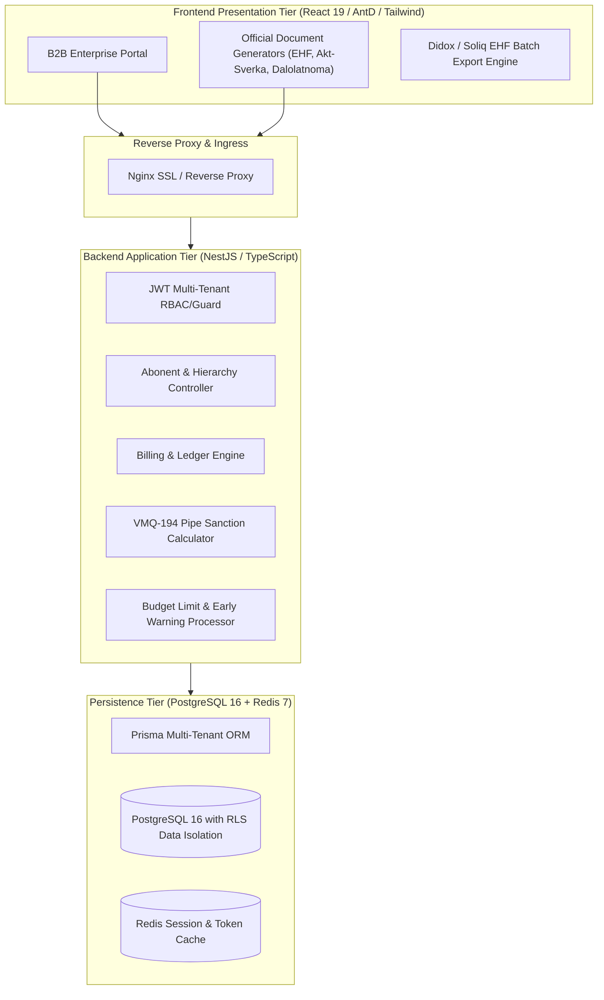

<div align="center">

# 💧 SuvControl Core Architecture
### Next-Generation Enterprise Water Utility Billing & Resource Governance Platform

[](https://www.typescriptlang.org/)
[](https://nestjs.com/)
[](https://react.dev/)
[](https://www.postgresql.org/)
[](https://www.prisma.io/)
[](https://www.docker.com/)

**National Hackathon Architectural Showcase Edition**

</div>

---

## 📌 Executive Summary

**SuvControl** is an enterprise-scale digital billing, smart metering, and automated revenue-assurance platform designed specifically for municipal and regional water utility authorities (*O'zsuvta'minot* ecosystems).

In Uzbekistan, water utilities face major systemic challenges:
1. **Non-Revenue Water (NRW) & Unmetered Tampering**: Billions of sums lost annually due to illegal tapping and unverified meters.
2. **B2B & Budget Organization Overspending**: State entities (schools, kindergartens, hospitals) exceeding approved budgetary limits without proactive warning.
3. **Manual Invoicing Latency**: Days spent preparing paper acts, manual E-faktura reconciliation, and bilateral debt audits (*Akt-sverka*).

**SuvControl** solves this through an end-to-end multi-tenant platform featuring automated pipe-diameter sanction engines, live Didox 12% VAT electronic invoice integration, 4-tier B2B hierarchy, and automated debt reconciliation.

---

## 🏛️ System Architecture



---

## ⚡ Core Features & Capabilities

### 1. 🏢 4-Tier B2B Consumer Hierarchy
Unlike typical B2C residential billing, commercial and state institutions operate on a multi-level structure:
$$\text{Parent Enterprise (STIR / INN)} \longrightarrow \text{Facilities (Branches / Schools)} \longrightarrow \text{Connection Points (Pipes)} \longrightarrow \text{Meters}$$
* Supports sub-metering deduction (master meter minus tenant consumption).
* Multi-branch aggregation for citywide department accounts.

### 2. ⚖️ Gosstandart VMQ-194 Pipe Capacity Sanction Engine
When meter tampering, illegal bypassing, or seal integrity violations occur, the engine calculates volumetric debt based on national hydraulic norms:
$$Q = \pi \cdot \left(\frac{d}{2}\right)^2 \cdot v \cdot t$$
* **$d$**: Internal pipe diameter ($mm$)
* **$v$**: Standard pressurized velocity ($1.2 \text{ m/s}$)
* **$t$**: Violation duration in seconds
* Generates an official, legally enforceable **Sanksiya Dalolatnomasi** with 12% VAT breakdown.

### 3. 📑 Automated Official Document Engines
* **E-Hisobvaraq Faktura (EHF)**: 12% QQS, MXIK (`03600001001000000`), E-IMZO stamp visualization.
* **Akt-Sverka**: Bilateral ledger reconciliation between water authority and enterprise accounting.
* **Spravka-Raschyot**: Formal tariff breakdowns for tax authorities.
* **Pretenziya**: Pre-trial formal notification with statutory deadlines.
* **Didox Batch Export**: One-click Excel compilation structured for Didox and Soliq.uz bulk import.

### 4. 📊 Budget Limit Early-Warning Engine
* Integrates 27-digit Single Treasury Accounts (*UzASBO / G'aznachilik*).
* Monitors real-time consumption against annual and monthly quotas.
* Triggers color-coded alerts at **80%** (Risk) and **100%** (Exceeded/Perebor).

---

## 🗄️ Database Schema Highlights

The platform schema is designed around high-performance multi-tenancy and audit compliance:

```prisma
// Excerpt from backend/prisma/schema.prisma

model Tenant {
  id             String    @id @default(uuid())
  name           String    // District name (e.g. Uchqo'rg'on, Norin)
  prefix         String    @unique // Unique regional code
  inn            String?   // Enterprise STIR
  vatCode        String?   // 12-digit VAT registry code
  bankAccount    String?   // 20-digit primary account
  directorName   String?
  accountantName String?
  
  Abonents       Abonent[]
  Facilities     Facility[]
  // ... full schema in backend/prisma/schema.prisma
}

model Facility {
  id             String    @id @default(uuid())
  tenantId       String
  abonentId      String
  name           String
  cadastreNumber String?
  address        String?
  ConnectionPoints ConnectionPoint[]
}

model SanctionLog {
  id                  String   @id @default(uuid())
  actNumber           String
  pipeDiameterMm      Decimal  @db.Decimal(6, 2)
  calculatedVolumeM3  Decimal  @db.Decimal(14, 3)
  totalSanctionAmount Decimal  @db.Decimal(14, 2)
  status              String   @default("ISSUED")
}
```

---

## 🔒 Hackathon Evaluation & Security Notice

> [!NOTE]
> **Showcase & Architectural Preview**:
> This repository represents the **architectural blueprint, interface contracts, regulatory math engines, and UI design systems** submitted for hackathon evaluation.
>
> To safeguard live utility consumers, commercial IP, and active production security:
> * Active production database credentials, private encryption keys, and SMS gateway tokens have been sanitized or stubbed.
> * Live automated billing background worker loops and payment provider webhook secrets are isolated in the private production cluster.
> * A fully operational live deployment is active at **[https://suvcontrol.uz](https://suvcontrol.uz)**.

---

## 👥 Authors & Team

* **Abdulloh Munzir** — Lead Architect & Full-Stack Engineer
* Project: **SuvControl (Water Utility Governance)**
* Repository: `AbdullohMunzir/suvcontrol-core`
