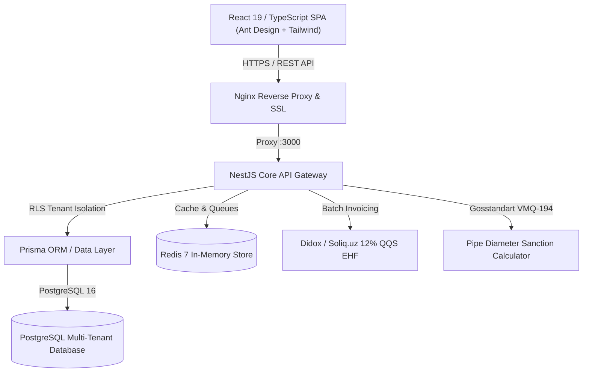

# SuvControl System Architecture & Engineering Specifications

## 1. High-Level Architecture Overview

SuvControl is an enterprise-grade Water Utility Billing & Resource Management Platform architected for regional and municipal water authorities (*Suv Ta'minoti*).

## 2. Multi-Tenancy & Data Isolation Model

The platform uses a single database with **Row-Level Security (RLS)** and tenant prefix segregation:
- Every district (*tuman suv ta'minoti*) operates as an isolated `Tenant`.
- Every query passes through an execution context that guarantees no district can read or alter another district's consumers, meters, or financial ledgers.
- The `prefix` system (e.g. `14242...`, `14219...`) ensures that abonent account numbers are unique and hierarchically partitioned across Uzbekistan.

## 3. Mathematical & Regulatory Formulas

### 3.1. VMQ-194 Gosstandart Pipe Diameter Flow Formula
When a water meter seal is broken, bypassed, or tampering is detected, consumption is recalculated based on hydraulic pipe capacity:

$$Q = \pi \cdot \left(\frac{d}{2}\right)^2 \cdot v \cdot t$$

Where:
* $d$: Internal pipe diameter in meters ($mm \times 10^{-3}$)
* $v$: Standard regulatory water velocity in pressurized mains ($1.2 \text{ m/s}$)
* $t$: Tampering or unmetered duration in seconds ($\text{hours} \times 3600$)

### 3.2. Penya (Overdue Penalty) Calculation
Under national commercial utility billing law:
* Daily accrual rate: $0.1\%$ per day of overdue balance.
* Maximum statutory cap: Penya cannot exceed $50\%$ of the principal debt:

$$\text{Penya} = \min\left(\text{PrincipalDebt} \times 0.001 \times \text{DaysOverdue}, \; 0.50 \times \text{PrincipalDebt}\right)$$

---

## 4. B2B Enterprise Hierarchy

Unlike residential consumers, commercial entities have a 4-tier structural model:
1. **Legal Entity (Bosh korxona)**: Holds the STIR (INN), OKED, and legal bank credentials.
2. **Facilities (Obyektlar / Filiallar)**: Individual physical sites (schools, kindergartens, factories, branches).
3. **Connection Points (Ulanish nuqtalari)**: Physical pipe entries with diameter, pressure, and sewage (oqova suv) ratios.
4. **Meters (Hisoblagichlar)**: Measuring units with verification (*qiyoslov*) tracking and telemetry.
